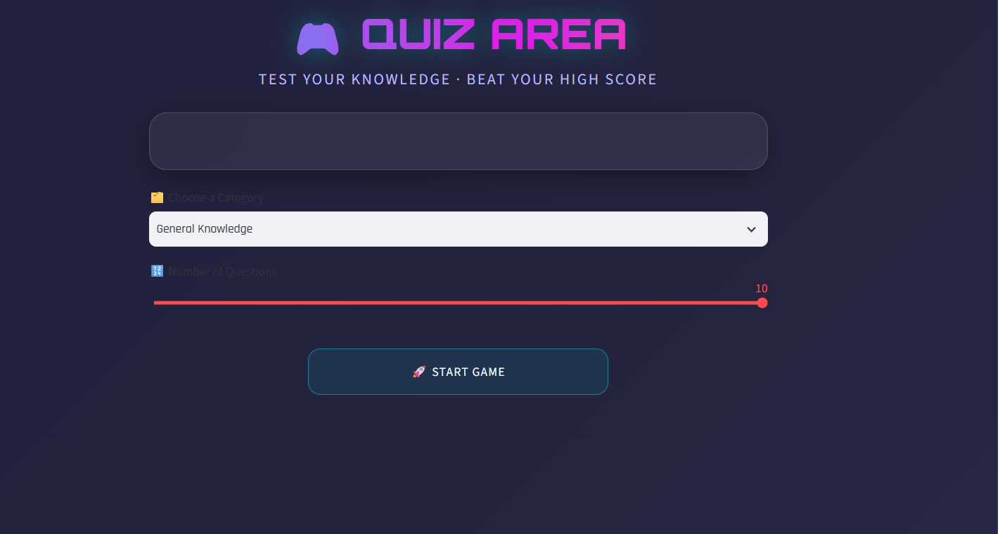
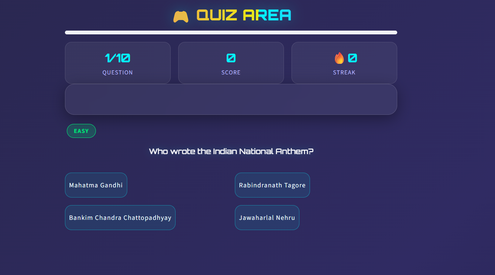
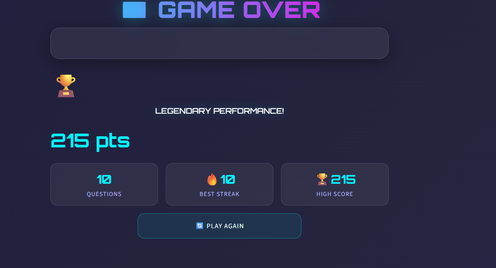

# 🎮 Quiz Area

> A modern, interactive quiz game built with **Python** and **Streamlit** featuring a gaming-inspired UI, multiple quiz categories, streak-based scoring, and an engaging user experience.
----

## 📖 About the Project

**Quiz Area** is a fun and interactive quiz application developed using **Python** and **Streamlit**. The application allows users to test their knowledge across different categories while enjoying a modern gaming interface with animations, score tracking, and optional background music.

The project demonstrates the use of Streamlit session state management, custom CSS styling, interactive UI components, and dynamic quiz generation.

---

## ✨ Features

- 🎮 Modern Gaming UI
- 📚 Multiple Quiz Categories
  - General Knowledge
  - Science
  - Movies & Pop Culture
  - Sports
- 🎯 Randomized Questions
- ⚡ Speed Bonus System
- 🔥 Streak Bonus Rewards
- 📊 Live Score Tracking
- 📈 Progress Bar
- 🏆 High Score Tracking
- 🎵 Optional Background Music
- 🎨 Custom CSS & Glassmorphism Design
- 📱 Responsive Streamlit Interface

---

## 🛠️ Built With

- Python 3
- Streamlit
- HTML & CSS (Custom Styling)

---

## 📂 Project Structure

```
Quiz_Game/
│
├── quiz_game_app.py      # Main Streamlit Application
├── requirements.txt      # Project Dependencies
├── background.mp3        # Optional Background Music
└── README.md
```

---

## ⚙️ Installation

Clone the repository

```bash
git clone https://github.com/sonalicodehub/Quiz_Game.git
```

Move into the project folder

cd Quiz_Game


Install dependencies

```bash
pip install -r requirements.txt
```

Run the application

```bash
streamlit run quiz_game_app.py
```

---

## 🎯 Scoring System

| Action | Points |
|---------|-------:|
| Correct Answer | +10 |
| Answer within 5 seconds | +5 Bonus |
| Consecutive Correct Answers | +2 Streak Bonus (Max +10) |

---

## 📸 Application Preview
<h2>🏠 Home Screen</h2>



<h2>❓ Quiz Screen</h2>



<h2>🏆 Result Screen</h2>




---

## 💡 Future Improvements

- ⏳ Countdown Timer
- 🌍 Online Leaderboard
- 👤 User Login & Authentication
- 🗄️ Database Integration
- 🏅 Achievement Badges
- 🌙 Dark/Light Theme Toggle
- 📊 Performance Analytics
- 🎵 Sound Effects
- 🤝 Multiplayer Quiz Mode
- 📱 Mobile Optimization

---

## 🎓 Learning Outcomes

This project helped in understanding:

- Streamlit Application Development
- Python Programming
- Session State Management
- UI/UX Design
- Custom CSS Integration
- Randomized Data Handling
- Interactive Web Applications

---

## 🤝 Contributing

Contributions, suggestions, and improvements are welcome.

1. Fork the repository
2. Create a feature branch
3. Commit your changes
4. Open a Pull Request

---

## 👩‍💻 Developer

**Sonali Gupta**

- GitHub: https://github.com/sonalicodehub
- LinkedIn:https://www.linkedin.com/in/sonali-gupta-410054371" target="blank"> 

---

## ⭐ Support

If you found this project helpful, please consider giving it a ⭐ on GitHub.

It motivates me to build more open-source projects.

---

## 📄 License

This project is licensed under the MIT License.


